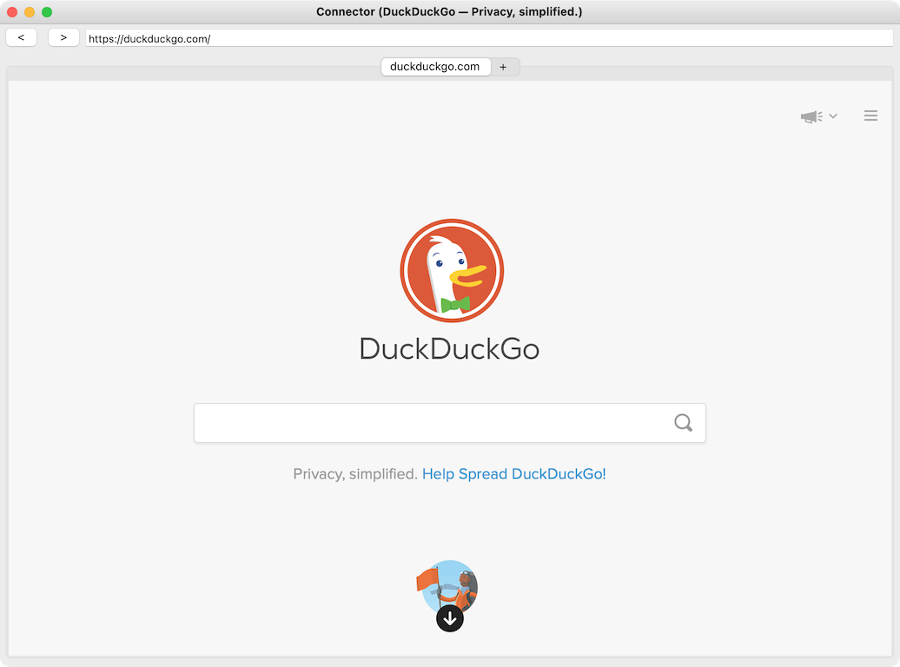

#  Connector

A minimalist open-source multi-engine web browser built in [Ruby](https://www.ruby-lang.org) with [Glimmer DSL for SWT](https://github.com/AndyObtiva/glimmer-dsl-swt)

NOTE: I am no web browser development expert. This project was created primarily for personal use and as a fun exercise in determining if software engineers could simply build their own web browsers instead of worrying about privacy rules in various available web browsers. As such, it has not had a packaged release. Feel free to inspect its code to learn more about how to get started in building a web browser with [Glimmer DSL for SWT](https://github.com/AndyObtiva/glimmer-dsl-swt). The project mostly takes advantage of the [SWT Browser widget](https://github.com/AndyObtiva/glimmer-dsl-swt/blob/master/docs/reference/GLIMMER_GUI_DSL_SYNTAX.md#browser-widget), which has support for [Chromium](https://www.chromium.org/) and [Webkit](https://webkit.org/). That said, it is a simple wrapper that does not expose all web browser engine features automatically, so quite a bit of extra work is needed to bring it up to par with common browsers, but it's 50% of the way there out of the box, which is very useful if someone needs to slap a custom web browser together in less than a day.

## Features

Unlike other web browsers, Connector is a multi-engine web browser, supporting both [Chromium](https://www.chromium.org/) and [Webkit](https://webkit.org/), albeit running old versions of them at the moment.

### Chromium Engine Support

### Webkit Engine Support

### Menu Bar

#### File Menu

#### Action Menu

#### Options Menu

#### Help Menu

### Preferences

## Change Log

[CHANGELOG.md](CHANGELOG.md)

## TODO

[TODO.md](TODO.md)

## Contributing to connector

-   Check out the latest master to make sure the feature hasn't been
    implemented or the bug hasn't been fixed yet.
-   Check out the issue tracker to make sure someone already hasn't
    requested it and/or contributed it.
-   Fork the project.
-   Start a feature/bugfix branch.
-   Commit and push until you are happy with your contribution.
-   Make sure to add tests for it. This is important so I don't break it
    in a future version unintentionally.
-   Please try not to mess with the Rakefile, version, or history. If
    you want to have your own version, or is otherwise necessary, that
    is fine, but please isolate to its own commit so I can cherry-pick
    around it.

## Copyright

[MIT](LICENSE.txt)

Copyright (c) 2021 Andy Maleh

---

 Built with [Glimmer DSL for SWT](https://github.com/AndyObtiva/glimmer-dsl-swt) (JRuby Desktop Development GUI Framework)

Connector icon made by <a href="https://www.flaticon.com/authors/freepik" title="Freepik">Freepik</a> from <a href="https://www.flaticon.com/" title="Flaticon">www.flaticon.com</a>
